# Phase 3: Observability & Monitoring Architecture

This directory contains the configuration and operational runbook for the comprehensive observability stack monitoring the **Currency Converter GitOps Pipeline**.

A true DevSecOps platform requires deep visibility into both the Continuous Integration engine (Jenkins) and the runtime deployment environment (Amazon EKS). This stack implements industry-standard tools to achieve full-stack observability, ensuring we can preemptively detect bottlenecks, track resource utilization, and maintain strict Service Level Objectives (SLOs).

---

## Architecture Overview

Our observability strategy is divided into three core pillars:

### 1. Infrastructure & CI Monitoring (Jenkins EC2)
* **AWS CloudWatch:** Monitors basic EC2 hardware metrics (CPU credit usage, disk I/O, network throughput).
* **Jenkins Prometheus Plugin:** Exposes internal CI metrics (build queue depth, executor status, job durations) via an unauthenticated `/prometheus/` endpoint.

### 2. Cluster & Application Monitoring (EKS)
* **Prometheus:** The central time-series database. Scrapes metrics from Kubernetes nodes (`node-exporter`), cluster state (`kube-state-metrics`), and our external Jenkins server.
* **Grafana:** Provides the visualization layer with pre-configured dashboards mapping CPU/Memory consumption against requested limits across the `dev`, `staging`, and `prod` namespaces.

### 3. Runtime Self-Healing (Kubernetes Probes)
* **Liveness & Readiness Probes:** The Currency Converter application exposes a `/health` endpoint. Kubernetes actively polls this to dynamically route traffic away from failing pods and automatically restart deadlocked containers.

---

## Deployment Instructions

### 1. Configure the Jenkins CI Server
Before deploying the cluster monitoring, Jenkins must be configured to expose its metrics.

1. Log into Jenkins as an Administrator.
2. Navigate to **Manage Jenkins -> Plugins -> Available Plugins**.
3. Search for and install the **Prometheus metrics** plugin.
4. Restart Jenkins.
5. Verify metrics are being published by visiting: `http://<JENKINS_IP>:8080/prometheus/`

**Jenkins EC2 Security Group Configuration:**
To allow Prometheus (running inside EKS) to scrape these metrics, the Jenkins EC2 Security Group must permit inbound TCP traffic on port 8080.

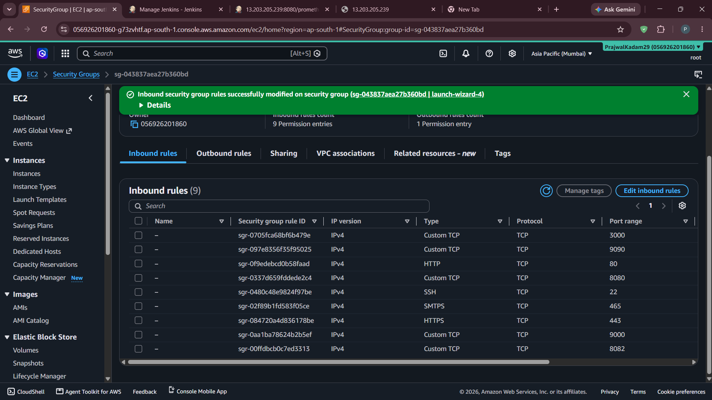

**Raw Prometheus Endpoint Validation:**
Navigating directly to the `/prometheus/` endpoint confirms that Jenkins is successfully exporting JVM garbage collection, memory pools, and job queue metrics.

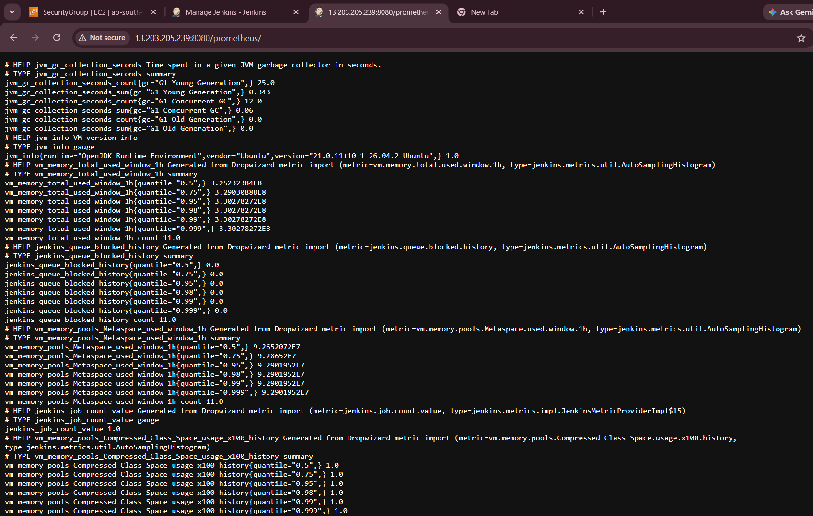

### 2. Deploy the Kube-Prometheus-Stack to EKS
We utilize the community-standard `kube-prometheus-stack` Helm chart to deploy Prometheus and Grafana simultaneously.

1. Add the Prometheus community Helm repository:
    ```bash
    helm repo add prometheus-community [https://prometheus-community.github.io/helm-charts](https://prometheus-community.github.io/helm-charts)
    helm repo update
    ```

2. Install the stack into a dedicated `monitoring` namespace, passing our custom `values.yaml` to ensure it scrapes the Jenkins server:
    ```bash
    helm install observability prometheus-community/kube-prometheus-stack \
      --namespace monitoring \
      --create-namespace \
      -f prometheus-grafana-values.yaml
    ```

### 3. Accessing the Dashboards
To maintain a secure cluster perimeter without exposing a public Ingress for the monitoring tools, we utilize secure `kubectl` port-forwarding to access the dashboards.

**1. Access Grafana:**
   ```bash
   kubectl port-forward svc/observability-grafana 3000:80 -n monitoring --address 0.0.0.0
   ```

Open `http://localhost:3000` in your browser. (Default login: `admin` / `finacplus-admin`).


**2. Access Prometheus (Direct Querying):**
   ```bash
   kubectl port-forward svc/observability-kube-prometheus-prometheus 9090:9090 -n monitoring --address 0.0.0.0
   ```


### 4. Importing the Jenkins Dashboard
While the `kube-prometheus-stack` provides extensive pre-configured Kubernetes dashboards, the specific CI/CD visualization requires manually importing the community-standard Jenkins dashboard.

1. In the Grafana left-hand sidebar, navigate to **Dashboards** and click **New -> Import**.
2. In the "Import via grafana.com" field, enter the official Jenkins dashboard ID: `9964`.
3. Click **Load**.
4. Select your cluster's Prometheus instance (typically named `Prometheus`) from the data source dropdown at the bottom of the configuration page.
5. Click **Import**. This instantly populates the **Jenkins: Performance and Health Overview** dashboard with real-time telemetry from your EC2 instance.


---

## Dashboard Visualizations

Once deployed, our stack provides a "single pane of glass" into the entire infrastructure.

### Grafana Authentication & Dashboard Directory

Accessing the Grafana portal provides a rich directory of pre-loaded Kubernetes mixin dashboards, augmented by our custom CI/CD tracking.

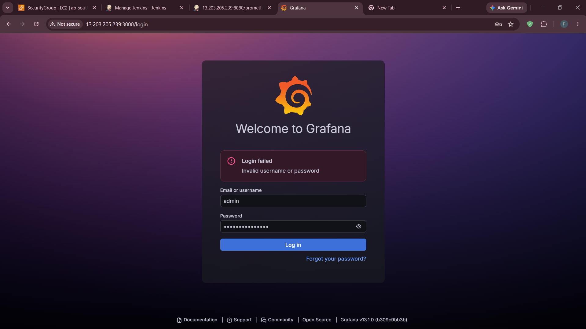


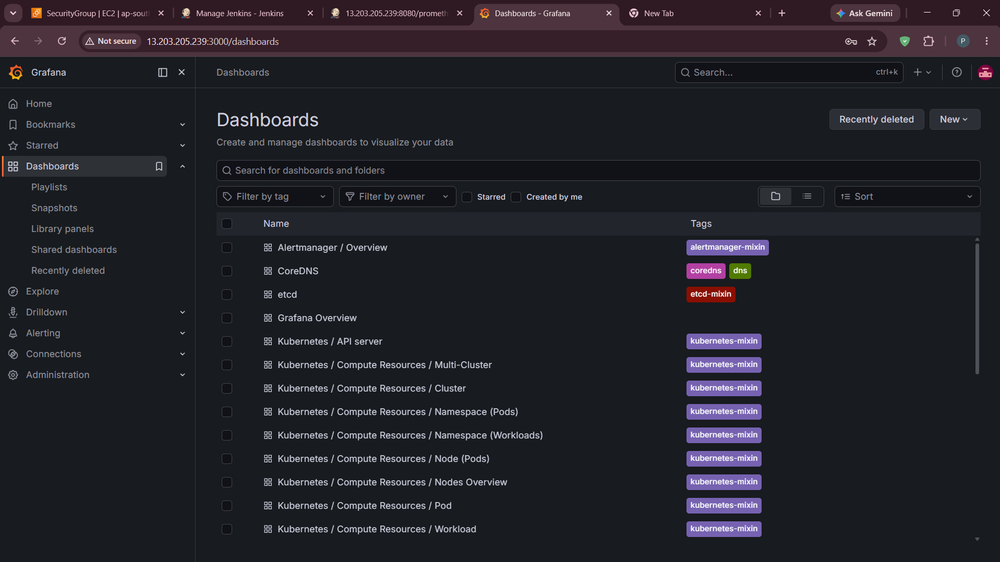


### Pillar 1: CI/CD Pipeline Telemetry (Jenkins)

By leveraging the `additionalScrapeConfigs` in our Helm values, the EKS Prometheus instance successfully reaches out and registers the Jenkins Master node as a healthy target.

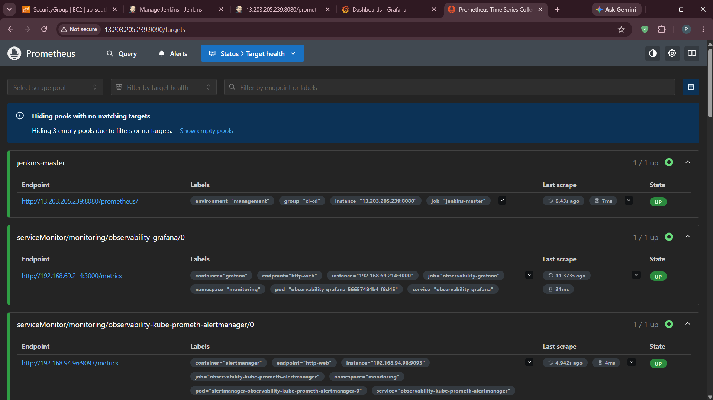

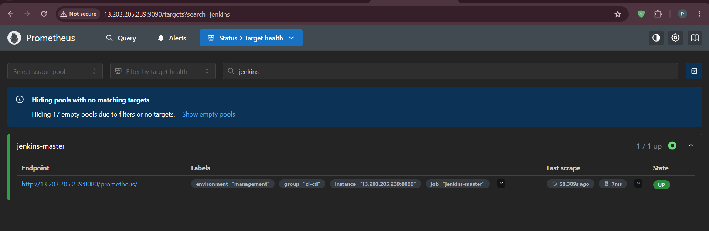

This telemetry is fed into our **Jenkins: Performance and Health Overview** dashboard, tracking JVM memory, active executor nodes, and pipeline queue depths in real-time.

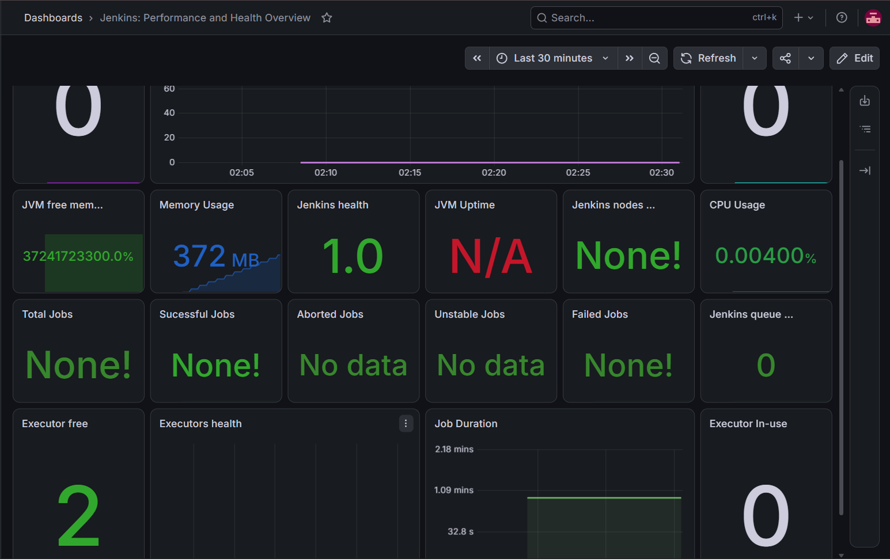


### Pillar 2: Kubernetes Cluster & Node Telemetry

Our infrastructure monitoring spans from macro-level cluster quotas down to individual EC2 node performance.

**1. Cluster Compute Resources:**
Tracking CPU and Memory requests/limits across the entire EKS fleet.

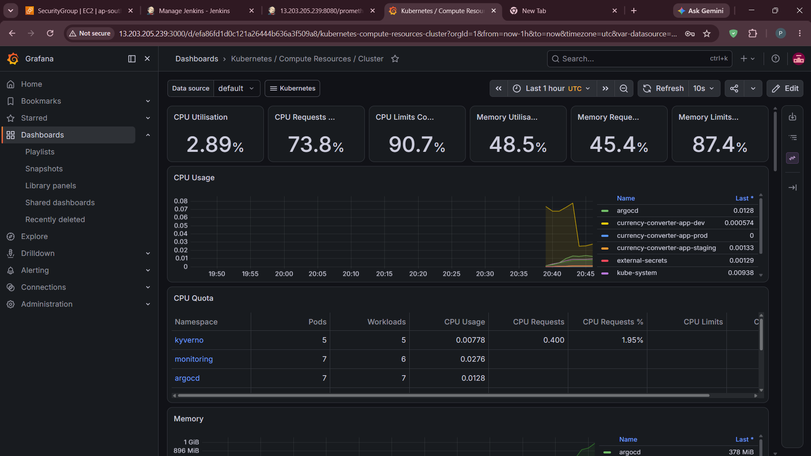


**2. EC2 Node Performance (Node Exporter):**
Granular visibility into hardware utilization (CPU load averages, RAM caching, and Disk I/O) for specific worker nodes within the EKS autoscaling group.

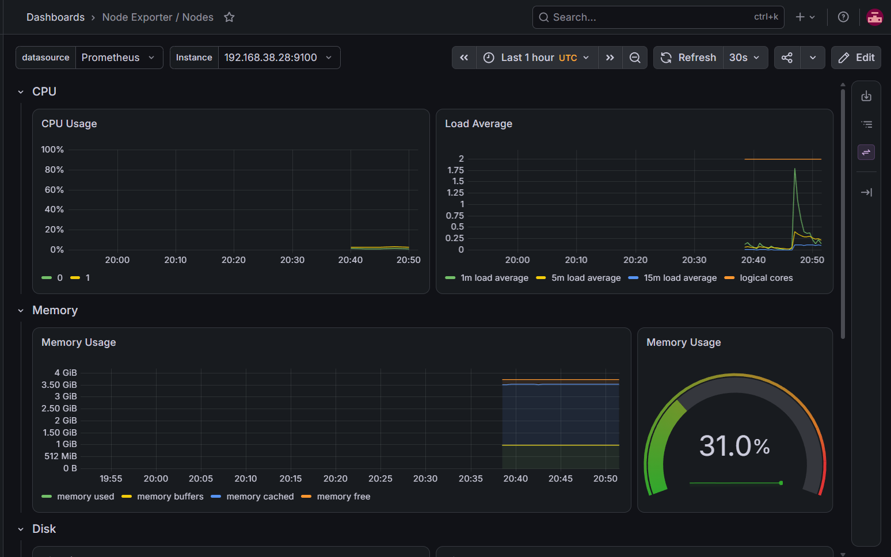

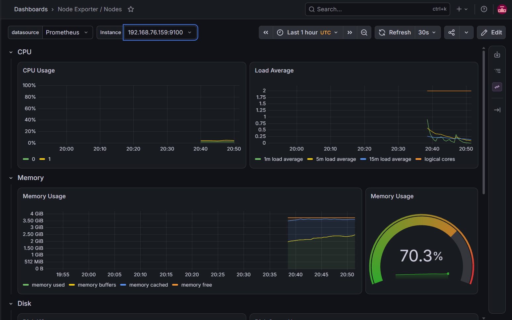


### Pillar 3: Workload & Application Telemetry

Because our GitOps pipeline uses ArgoCD to deploy isolated namespaces, we can monitor application health per environment.

**1. Staging Workload CPU Utilization:**
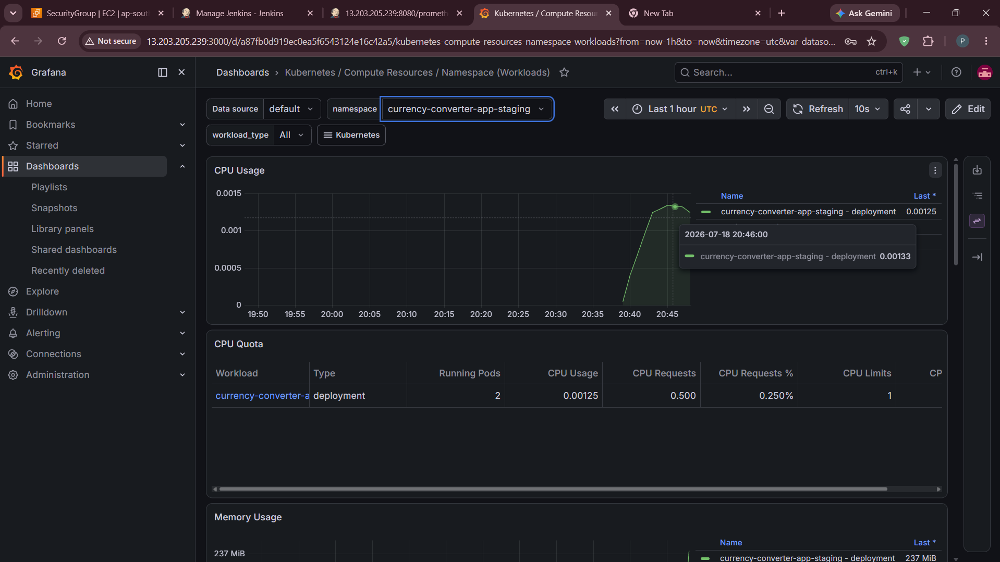


**2. Dev Workload CPU Utilization:**

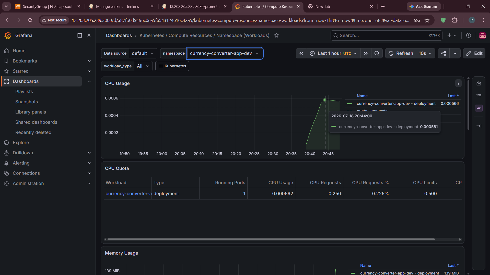


**3. Node-Level Pod Distribution:**
Tracking the resource footprint of core services like the ArgoCD ApplicationSet controller, Dex server, and External Secrets webhook.


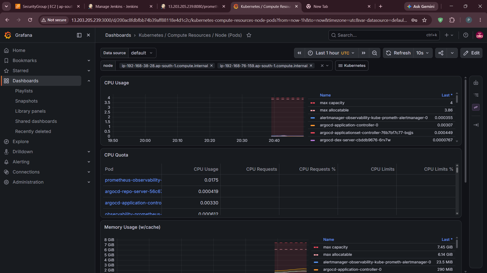


**4. Pod Networking:**
Observing transmit and receive bandwidth for individual application pods (e.g., the AWS VPC CNI node agent).

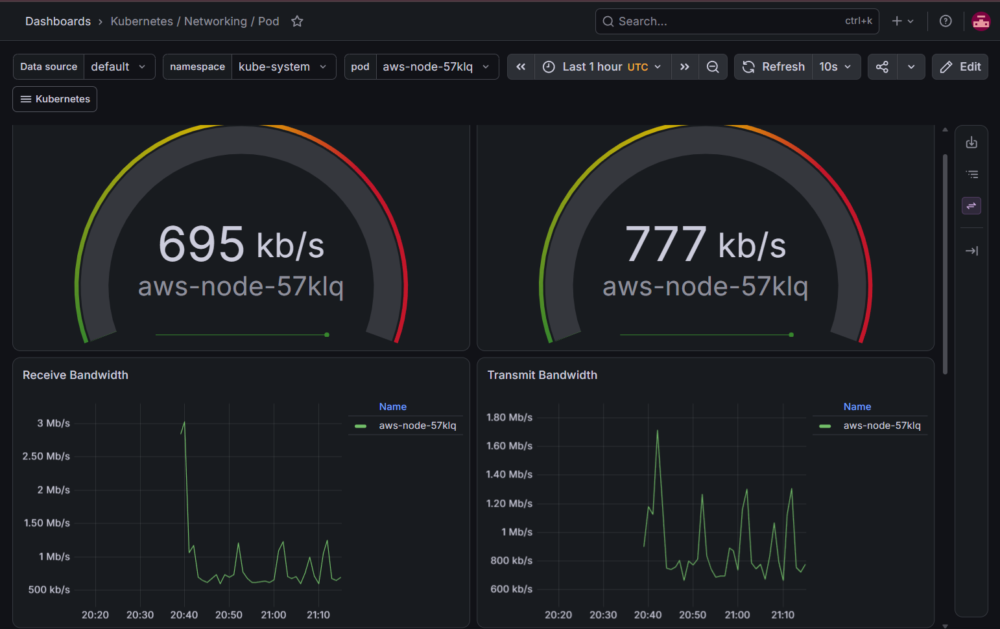


### Pillar 4: Control Plane Health

Monitoring the Kubernetes orchestrator is critical for cluster stability.

**1. API Server Availability:** Maintaining strict adherence to our 99.000% uptime SLO.

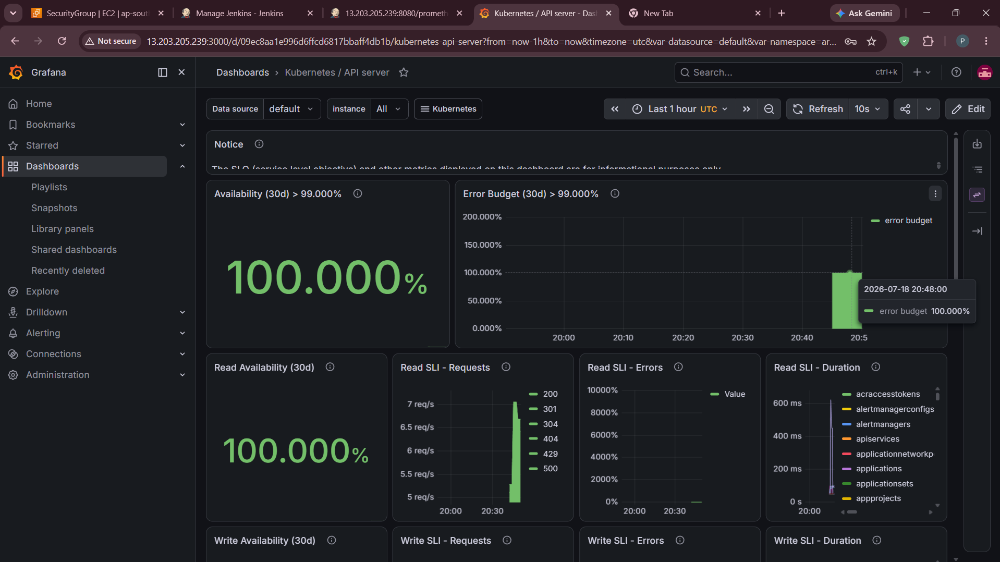

**2. API Server Work Queue:** Tracking latency and request volume to detect control plane bottlenecks.

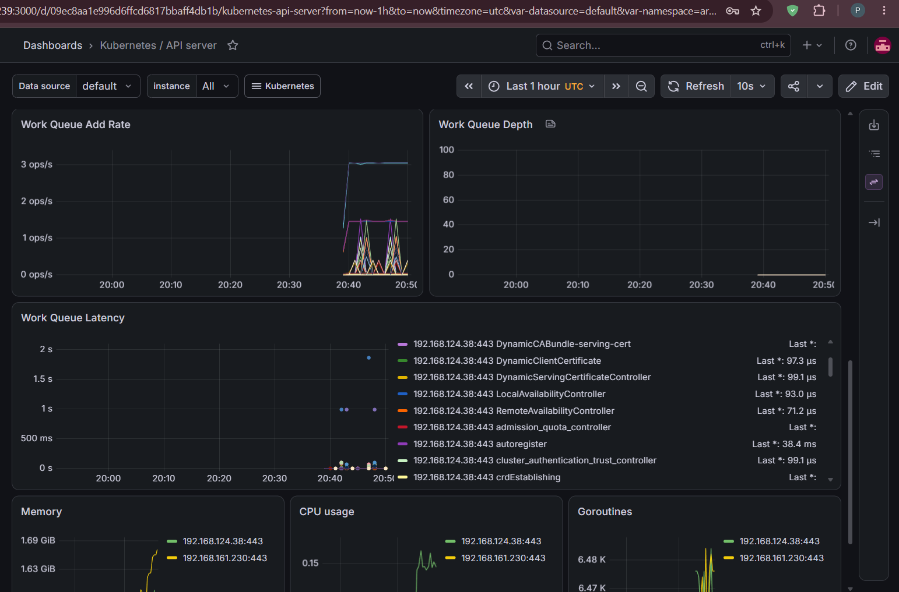

**3. Kubelet & CoreDNS:** Tracking running pods, volume mounts, and DNS request resolutions across the cluster.

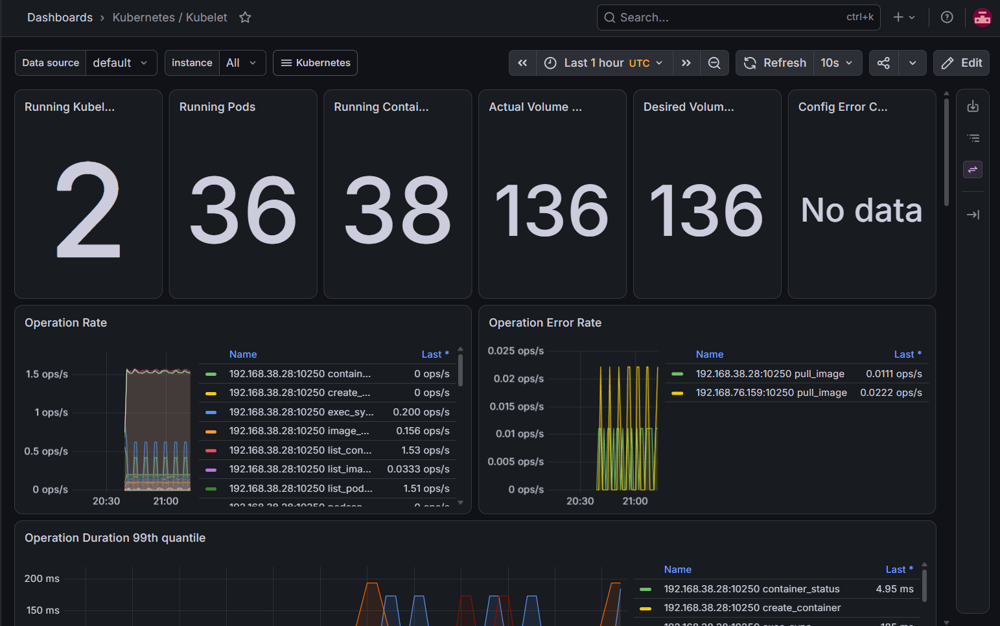

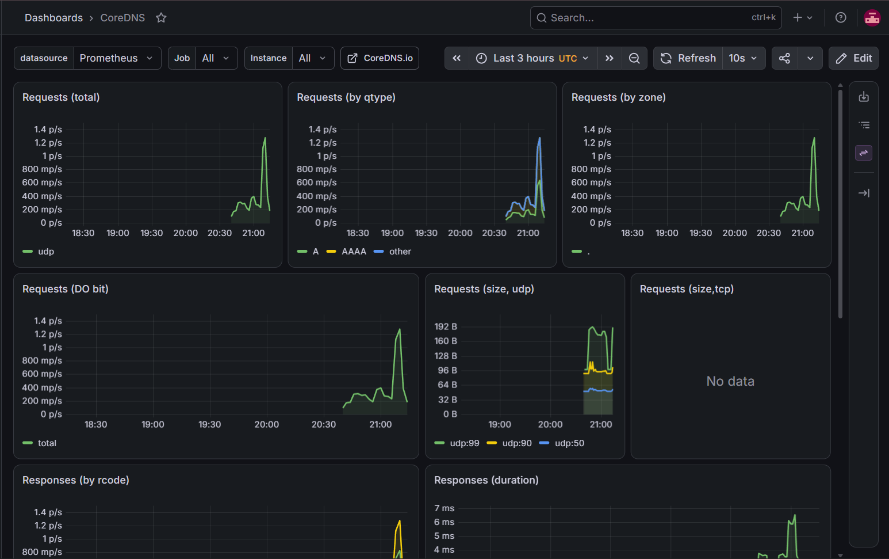

---

## Validating Application Health Probes

The Currency Converter application uses Kubernetes health probes. To verify these are functioning correctly, you can describe a running pod in any environment:

```bash
kubectl describe pod -l app=currency-converter-app -n currency-converter-app-dev
```

You should see output confirming the probes are active and passing:
```terminaloutput
Liveness:   http-get http://:8080/health delay=30s timeout=1s period=15s #success=1 #failure=3
Readiness:  http-get http://:8080/health delay=15s timeout=1s period=10s #success=1 #failure=3
```

---

## Trade-offs & Future Improvements

**1. Local Persistent Volumes:** Currently, Prometheus uses ephemeral pod storage. In a real production environment, this Helm chart should be configured to use AWS EBS CSI volumes for long-term metric retention.

**2. Alertmanager Integration:** While Prometheus is collecting data, Alertmanager is not currently hooked into Slack or PagerDuty. A production-ready iteration would configure alerting rules (e.g., `JenkinsQueueTooLong`, `PodCrashLooping`) to proactively page the SRE team.

**3. Cross-VPC Networking:** During initial staging, Prometheus scraped the Jenkins server via its Public IP. In the final Terraform deployment, both resources reside in the same VPC, allowing Prometheus to scrape via the Jenkins Private IP, ensuring telemetry data remains entirely on the internal AWS backbone.

---
